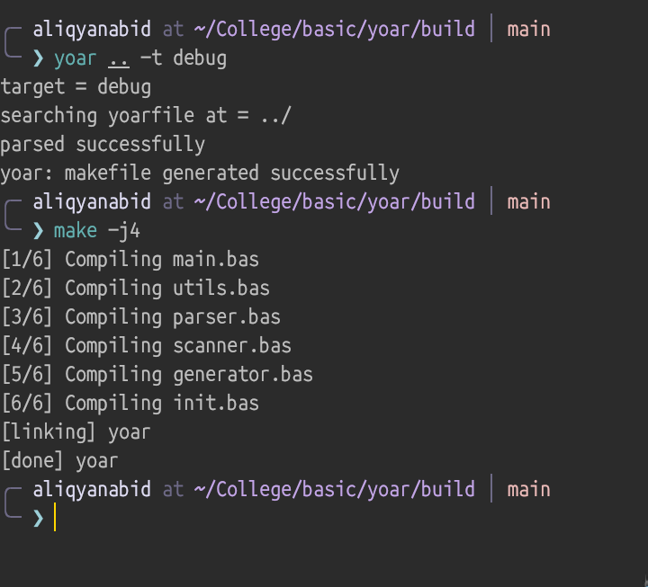

## YOAR

Build system for free basic.
Cmake like build system, though not completely cmake.

### Features:
- write your config in yoarfile (ini style)
- build, include, linking.
- incremental build
- parallel building
- prebuild and posbuild hooks (custom commands)

### Yoar builds with Yoar



### Get started

1. **Clone**

2. **Build**
```bash
cd yoar
make
```
> yoar binary will be built in 'bin' directory

3. **Usage**
```
./yoar --help
```

4. **Write yoarfile**
Take a look at [example](example/yoarfile) to see sample yoarfile

### Todo

- [ ] better code...(forever venture)
- [ ] windows support
